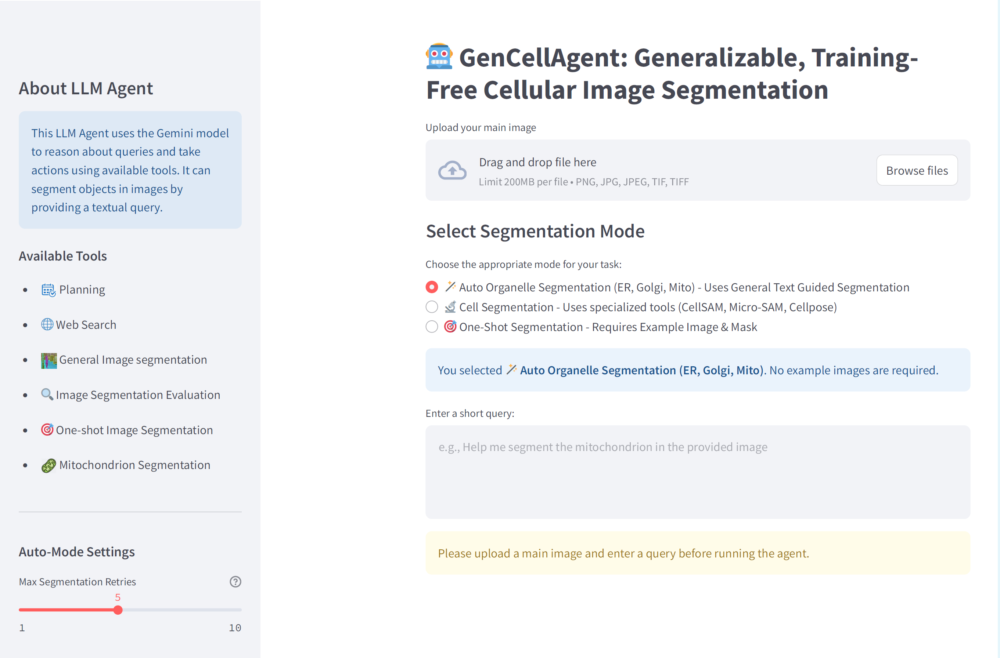

# 🤖 GenCellAgent: Generalizable, Training-Free Cellular Image Segmentation via Large Language Model Agents

This repository provides a comprehensive guide and implementation for GenCELLAgent from scratch using Google's Gemini as the Large Language Model (LLM) of choice.


## 📚 Contents

GenCELLAgent is a **training-free, multi-agent large language model system** designed for **generalizable cellular image segmentation**. It orchestrates multiple vision and segmentation tools — such as Cellpose, µSAM, ERNet, MitoNet, LISA, and SegGPT — through a collaborative framework. The agent follows a structured **plan–execute–evaluate** loop, enhanced with memory and self-evolution mechanisms.

Unlike traditional models that require fine-tuning or dataset-specific retraining, GenCELLAgent dynamically routes tasks across specialized and generalist models. It intelligently adapts to various imaging modalities (phase-contrast, fluorescence, confocal, EM, and histology) and even to novel biological structures via **in-context learning (ICL)** and **text-guided prompt refinement**.

### ✨ Key Features
- **Tool-Orchestrated Segmentation:** Integrates domain-specific and generalist segmenters for optimal results.
- **Adaptive Planning:** Uses Gemini to select segmentation strategies based on image style, context, and prior success.
- **Iterative Refinement:** Employs multi-step feedback using evaluator models to improve segmentation quality.
- **Human-in-the-Loop (HITL):** Supports interactive corrections with point, polygon, or region editing.
- **Self-Evolving Memory:** Stores past results and configurations to improve future segmentation sessions.

### 📈 Performance
Across multiple benchmark datasets, including **LiveCell**, **TissueNet**, **PlantSeg**, **Lizard** and **CellMap organelle data**, GenCELLAgent achieves:
- +15.7% mean segmentation accuracy improvement over specialist models.
- +37.6% average IoU gain on ER and mitochondria datasets.
- Strong generalization to unseen organelles (e.g., Golgi) using iterative refinement and test-time scaling.

### 🧠 Architecture Overview
GenCELLAgent’s architecture includes three coordinated modules:
1. **Planner (LLM):** Analyzes task context and decides segmentation routes.
2. **Executor:** Runs selected tools (Cellpose, µSAM, etc.).
3. **Evaluator:** Uses VLM-based quality scoring to iteratively refine predictions.

This design enables GenCELLAgent to perform segmentation tasks robustly without retraining, adapting to new domains with minimal supervision.

## 🖥️ GUI Demo



## 🚀 Getting Started

### Installation

1. Clone the repository:
   ```bash
   git clone https://github.com/yuxi120407/GenCELLAgent.git
   cd GenCELLAgent
   ```

2. Create and activate the conda environment:
   ```bash
   conda env create -f environment.yml
   conda activate gencell
   ```

   This installs Python 3.12, PyTorch 2.7.0 (CUDA 12.6), and all required dependencies.

3. Install SAM3 (Segment Anything Model 3) as a local editable package:
   ```bash
   cd src/sam3
   pip install -e ".[notebooks,train,dev]"
   cd ../..
   ```

   > **Note:** SAM3 must be installed manually after environment creation. The source is already included at `src/sam3/`.

### API & Credentials Configuration

GenCellAgent requires three different API setups to function fully: **Vertex AI** (for the main reasoning loop), **Google AI Studio** (for tool-level summarization), and **SerpAPI** (for web searching).

#### 1. Vertex AI Setup (Main Agent)
The core "brain" of the agent uses Google Cloud Vertex AI. To authenticate, you must generate a Service Account JSON key:

1.  **Create a Google Cloud Project:**
    - Go to the [Google Cloud Console](https://console.cloud.google.com/).
    - Click the project dropdown at the top and select **"New Project"**. Name it and click "Create".
2.  **Enable the Vertex AI API:**
    - In the top search bar, search for **"Vertex AI API"**.
    - Click on it and click the blue **"Enable"** button.
3.  **Generate a Service Account JSON Key:** 
    - Open the left-hand navigation menu (hamburger icon) and go to **IAM & Admin > Service Accounts**.
    - Click **"+ CREATE SERVICE ACCOUNT"** at the top.
    - Give it a name (e.g., `gencell-agent-sa`) and click "Create and Continue".
    - In the "Select a role" dropdown, search for and select **"Vertex AI User"**. Click "Continue", then "Done".
    - You will now see your new service account in the list. Click on the **three vertical dots (Actions)** on the right side of your service account and select **"Manage keys"**.
    - Click **"ADD KEY" > "Create new key"**.
    - Choose **JSON** and click **"Create"**. The file will automatically download to your computer.
4.  **Local Configuration:**
    - Move the downloaded `.json` file into your project folder (e.g., `src/credentials/my-project-key.json`).
    - Create the `config` directory if it doesn't exist:
      ```bash
      mkdir -p config
      ```
    - Copy the example config file and edit it with your credentials:
      ```bash
      cp config/config.example.yml config/config.yml
      ```
    - Edit `config/config.yml` with your actual values:
      ```yaml
      # GenCELLAgent Configuration File
      # Fill in your Google Cloud / Vertex AI credentials below

      # Your Google Cloud Project ID (found on your GCP dashboard homepage)
      project_id: "your-gcp-project-id"

      # Google Cloud region (e.g., us-central1, us-east1, etc.)
      region: "us-central1"

      # Path to your Google Cloud service account JSON credentials file
      # Use absolute path (e.g., /home/user/GenCELLAgent/src/credentials/my-key.json)
      # You can leave this empty if using environment variables or default credentials
      credentials_json: "/absolute/path/to/your/service-account-key.json"

      # Gemini model name to use
      # Options: gemini-3-flash-preview, gemini-2.5-flash, etc.
      model_name: "gemini-2.5-flash"
      ```

#### 2. .env File Setup (Tools)
For specialized tools (Search, Evaluation, etc.), create a `.env` file in the root of the project:
```bash
touch .env
```

Add the following keys to your `.env` file:

- **Google API Key (AI Studio):**
  1. Get a free API key from [Google AI Studio](https://aistudio.google.com/app/apikey).
  2. Add it to `.env`: `GOOGLE_API_KEY=your_ai_studio_key`
  
- **SerpAPI Key (Search):**
  1. Get an API key from [SerpAPI](https://serpapi.com/).
  2. Add it to `.env`: `SERPAPI_API_KEY=your_serp_api_key`

---

## 💻 Running the Demo

Launch the Streamlit interface:
```bash
streamlit run GUI_demo.py
```

### ⚠️ Troubleshooting

If you encounter configuration errors on startup:

1. **"No such file or directory: './config/config.yml'"**
   - Make sure you created the `config/config.yml` file in the project root directory
   - Verify the file path: `/path/to/GenCELLAgent/config/config.yml`
   - See the "API & Credentials Configuration" section above for the template

2. **"Failed to load the configuration file"**
   - Check that your `config.yml` has proper YAML syntax
   - Ensure all required fields are filled: `project_id`, `region`, `credentials_json`, `model_name`
   - Use absolute paths for `credentials_json`, not relative paths

3. **Authentication errors with Vertex AI**
   - Verify your service account JSON file path is correct
   - Ensure the Vertex AI API is enabled in your Google Cloud project
   - Check that your service account has "Vertex AI User" role assigned

## 🔧 Developer Guide: Add a New Tool

Use `cellpose` as the example. The same pattern works for other tools.

### 1. Install the tool env

If the tool needs its own environment, install it there and keep the Python path.

Example:

```bash
python -m venv /path/to/cellpose_env
/path/to/cellpose_env/bin/pip install cellpose
```

In this project, `cellpose` uses:

```bash
/home/idies/workspace/Storage/xyu1/persistent/pytorch_env/micro-sam/bin/python
```

### 2. Add a runner

Put env-specific execution in a small runner script, not in `GUI_demo.py`.

Example files:

- [cell_segmentation_env_runner.py](/src/tools/cell_segmentation_env_runner.py)
- [cell_segmentation_models.py](/src/tools/cell_segmentation_models.py)

The wrapper calls the env Python with `subprocess.run(...)` and returns standard output paths.

### 3. Return standard output keys

To reuse the current GUI display logic, return:

- `segment_save_path:`
- `segment_mask_path:`

Example:

```python
return f"Cellpose segmentation completed successfully in segment_save_path:{overlay_path}, the corresponding mask saved in segment_mask_path:{mask_path}"
```

### 4. Add the tool to `GUI_demo.py`

In [GUI_demo.py](/home/idies/workspace/Storage/xyu1/persistent/GenCELLAgent/GUI_demo.py):

1. Import the wrapper.
2. Add a new enum name in `Name`.
3. Register the tool.
4. If it is a segmentation tool, add it to the retry-count logic in `Agent.act(...)`.

Example registration:

```python
st.session_state.agent.register(Name.CELLPOSE, cellpose_segment)
```

### 5. Update the prompts

Also update these two files so the LLM knows when to use the new tool:

- [prompt/react.txt](prompt/react.txt)
- [prompt/planning.txt](prompt/planning.txt)

Add:

- the tool name to the tool list
- a short tool description
- one JSON action example
- a rule for when the planner should choose it

### 6. Final check

Before using the tool, verify:

- the env Python path is correct
- the tool is added to `Name`
- the tool is registered in `GUI_demo.py`
- the prompt files mention it
- it returns `segment_save_path` and `segment_mask_path`
