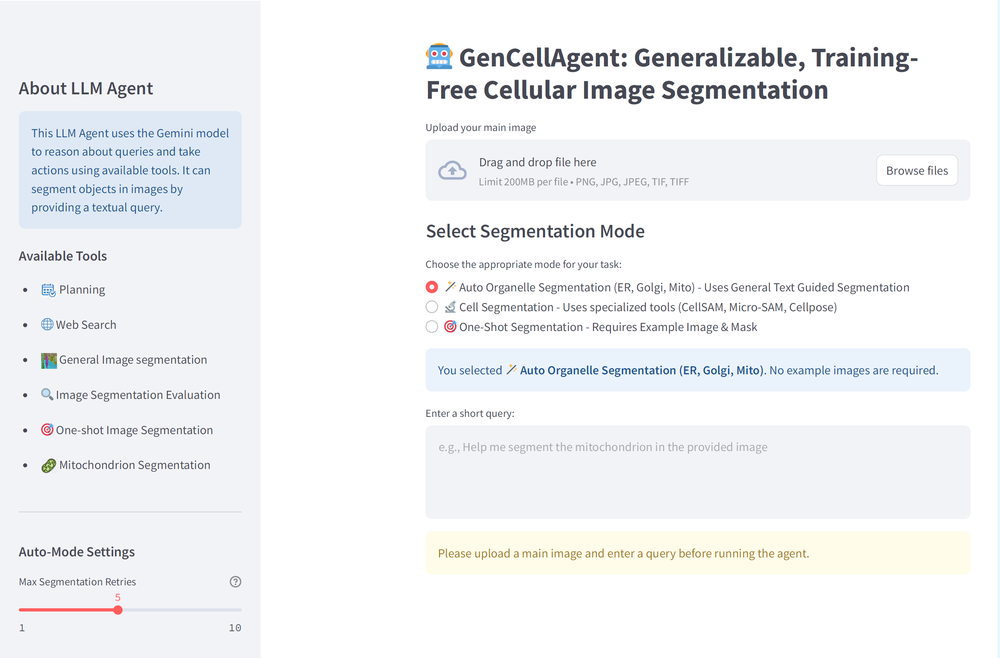

# 🤖 GenCellAgent: Generalizable, Training-Free Cellular Image Segmentation via Large Language Model Agents

This repository provides a comprehensive guide and implementation for GenCELLAgent from scratch using Google's Gemini as the Large Language Model (LLM) of choice.


## 📚 Contents

GenCELLAgent is a **training-free, multi-agent large language model system** designed for **generalizable cellular image segmentation**. It orchestrates multiple vision and segmentation tools — such as Cellpose, µSAM, ERNet, MitoNet, LISA, and SegGPT — through a collaborative framework. The agent follows a structured **plan–execute–evaluate** loop, enhanced with memory and self-evolution mechanisms.

Unlike traditional models that require fine-tuning or dataset-specific retraining, GenCELLAgent dynamically routes tasks across specialized and generalist models. It intelligently adapts to various imaging modalities (phase-contrast, fluorescence, confocal, EM, and histology) and even to novel biological structures via **in-context learning (ICL)** and **text-guided prompt refinement**.

### ✨ Key Features
- **Tool-Orchestrated Segmentation:** Integrates domain-specific and generalist segmenters for optimal results.
- **Adaptive Planning:** Uses Gemini to select segmentation strategies based on image style, context, and prior success.
- **Iterative Refinement:** Employs multi-step feedback using evaluator models to improve segmentation quality.
- **Human-in-the-Loop (HITL):** Supports interactive corrections with point, polygon, or region editing.
- **Self-Evolving Memory:** Stores past results and configurations to improve future segmentation sessions.

### 📈 Performance
Across multiple benchmark datasets, including **LiveCell**, **TissueNet**, **PlantSeg**, **Lizard** and **CellMap organelle data**, GenCELLAgent achieves:
- +15.7% mean segmentation accuracy improvement over specialist models.
- +37.6% average IoU gain on ER and mitochondria datasets.
- Strong generalization to unseen organelles (e.g., Golgi) using iterative refinement and test-time scaling.

### 🧠 Architecture Overview
GenCELLAgent’s architecture includes three coordinated modules:
1. **Planner (LLM):** Analyzes task context and decides segmentation routes.
2. **Executor:** Runs selected tools (Cellpose, µSAM, etc.).
3. **Evaluator:** Uses VLM-based quality scoring to iteratively refine predictions.

This design enables GenCELLAgent to perform segmentation tasks robustly without retraining, adapting to new domains with minimal supervision.

## 🖥️ GUI Demo



## 🚀 Getting Started

### Installation
   This requires Python 3.12 or higher, PyTorch 2.7 or higher, and a CUDA-compatible GPU with CUDA 12.6 or higher. [[Installation Setup Video Tutorial](https://www.youtube.com/watch?v=lolWgru3WwI)]  
   
1. Clone the repository:
   ```bash
   git clone https://github.com/yuxi120407/GenCELLAgent.git
   cd GenCELLAgent
   ```

2. Create and activate the conda environment:
   ```bash
   conda env create -f environment.yml
   conda activate gencell
   ```
3. Install miro-sam
   ```bash
    conda install -c conda-forge micro_sam
   ```

4. Clone and install SAM3:
   ```bash
   git clone https://github.com/facebookresearch/sam3.git src/sam3
   cd src/sam3 && pip install -e ".[notebooks,train,dev]" && cd ../..
     pip install "setuptools<70" "tifffile<2025"
   ```

   > **Note:** All model weights (VGG, Cellpose, micro-SAM, CellSAM, SAM3, SegGPT) can be downloaded from [models/README.md](models/README.md).

### API Key Setup

GenCELLAgent uses the Google Gemini API for LLM-powered mode detection, organelle segmentation, and evaluation. Only **two API keys** are needed: [[API Key Setup Video Tutorial](https://youtu.be/l1jxXL--Pl0?si=BJWJEmEFU3Yf-ExL)]  

1. **Get a Google API Key:**
   - Go to [Google AI Studio](https://aistudio.google.com/app/apikey)
   - Click "Create API Key" and copy it

2. **Get a SerpAPI Key** (optional, for web search):
   - Sign up at [SerpAPI](https://serpapi.com/) and copy your key

3. **Create a `.env` file** in the project root:
   ```bash
   GOOGLE_API_KEY=your_google_api_key_here
   SERPAPI_API_KEY=your_serpapi_key_here
   ```

That's it! No Google Cloud project, no Vertex AI, no service account JSON needed.

> **Need help?** If you have any issues with installation, API key setup, or running the code, please feel free to [open an issue](https://github.com/yuxi120407/GenCELLAgent/issues). We will be more than happy to help you!

---

## 🧪 Batch Segmentation Pipeline

GenCELLAgent provides a unified batch pipeline with **three segmentation modes**, automatically selected based on your natural language prompt:

### Cell Mode — Automatic Tool Selection

The system uses VGG style similarity to automatically select the best tool (Cellpose, micro-SAM, or CellSAM) for your image:

```bash
# Auto-selects the best tool based on image style
python batch_segment.py --image examples/cells/A172_Phase_A7_2_01d00h00m_4.tif --prompt "Help me segment all the cells in the provided image"

# Different image types auto-route to different tools:
python batch_segment.py --image examples/yeast/im051.tif --prompt "segment all cells"
python batch_segment.py --image examples/plantseg/plantseg_root_val_Movie1_t00004_crop_gt_00013.tif --prompt "segment all cells"

# Force a specific tool if needed:
python batch_segment.py --image examples/yeast/im051.tif --prompt "segment cells" --tool cellsam
```

### Organelle Mode — Gemini + SAM3 with Iterative Feedback

For sub-cellular structures, Gemini generates segmentation prompts and iteratively refines results:

```bash
python batch_segment.py --image examples/golgi/images/sample_0000.png --prompt "segment the golgi" --max_iterations 3
python batch_segment.py --image examples/mito/images/image_023FCj.png --prompt "find mitochondria" --max_iterations 3
python batch_segment.py --image examples/er/images/image_1.png --prompt "segment ER" --max_iterations 3
```

### Reference Mode — SegGPT One-Shot Segmentation

Provide a reference image-mask pair to segment similar structures in new images:

```bash
python batch_segment.py --image examples/er/images/image_101.png --prompt "segment using reference" --reference_image examples/er/images/image_1.png --reference_mask examples/er/labels/label_1.png
```

### Batch Processing

Process all images in a directory:

```bash
python batch_segment.py --image_dir examples/cells/ --prompt "segment all cells"
python batch_segment.py --image_dir examples/golgi/images/ --prompt "segment golgi" --max_iterations 5
```

### Python API

```python
from batch_segment import segment, batch_segment

# Auto mode detection + tool selection
result = segment("image.tif", prompt="Help me segment all cells")

# Organelle with feedback loop
result = segment("image.tif", prompt="segment golgi", max_iterations=5)

# Reference-based one-shot
result = segment("image.tif", prompt="segment", reference_image="ref.tif", reference_mask="mask.tif")

# Batch processing
results = batch_segment("path/to/images/", prompt="segment cells")
```

---

## 💻 Running the Demo

Launch the Streamlit interface:
```bash
streamlit run GUI_demo.py
```

### Example: Golgi Segmentation in Auto Mode

The **Auto Organelle Segmentation** mode enables training-free segmentation of organelles like ER, Golgi iterative refinement. Here's how to segment Golgi apparatus:

1. **Launch the GUI:**
   ```bash
   streamlit run GUI_demo.py
   ```

2. **Upload your image:**
   - Click "Browse files" to upload your electron microscopy image containing Golgi structures
   - Supported formats: PNG, JPG, JPEG, TIF, TIFF
   - Example images are available in `data/golgi/images/` (e.g., `image_9.png`, `image_15.png`)

3. **Select Auto Mode:**
   - Choose **"🪄 Auto Organelle Segmentation (ER, Golgi, Mito) - Uses General Text Guided Segmentation"**
   - This mode automatically uses text-guided segmentation with iterative refinement

4. **Configure Settings (Sidebar):**
   - **Max Segmentation Retries:** Set to 2
     - Higher values allow more refinement iterations for better quality
     - The agent will iteratively improve segmentation based on VLM feedback

5. **Provide Task Description:**
   - In the text box, describe your segmentation goal, for example:
     ```
     Help me segment the Golgi in the given image
     ```

6. **Run Segmentation:**
   - Click **"Send"**

### ⚠️ Troubleshooting

1. **"No API key was provided"**
   - Make sure `.env` file exists in the project root with `GOOGLE_API_KEY=your_key`

2. **"No module named 'pkg_resources'"**
   - Run `pip install setuptools`

3. **"GL ES 2.0 library not found"**
   - This is a napari/OpenGL error on headless servers. The code auto-mocks napari, but if it appears, ensure `batch_segment.py` is used (not older scripts)

## 🔧 Developer Guide: Add a New Tool

All segmentation tools run directly in the same environment (no subprocess needed).

### 1. Add the tool function in `batch_segment.py`

```python
def my_tool_segment_direct(image_path: str, save_dir: str = None, **_) -> str:
    save_dir = save_dir or os.path.join("output", "batch_results")
    # Your segmentation logic here
    seg = my_tool.run(image_path)
    overlay_path, mask_path = _save_overlay_and_mask(image_path, seg, save_dir, "my_tool")
    return f"Segmentation completed in segment_save_path:{overlay_path}, segment_mask_path:{mask_path}"
```

### 2. Register in TOOL_MAP

```python
TOOL_MAP = {
    "cellpose": cellpose_segment_direct,
    "micro_sam": micro_sam_segment_direct,
    "cellsam": cellsam_segment_direct,
    "my_tool": my_tool_segment_direct,  # Add here
}
```

### 3. Add to BEST_TOOL mapping

```python
BEST_TOOL = {
    ...
    "MyDataset": "my_tool",  # Map a reference dataset to your tool
}
```

### 4. Register in GUI_demo.py

```python
from batch_segment import my_tool_segment_direct as my_tool_segment
st.session_state.agent.register(Name.MY_TOOL, my_tool_segment)
```

### 5. Update prompts

Add the tool to `prompt/react.txt` and `prompt/planning.txt` so the LLM knows when to use it.
